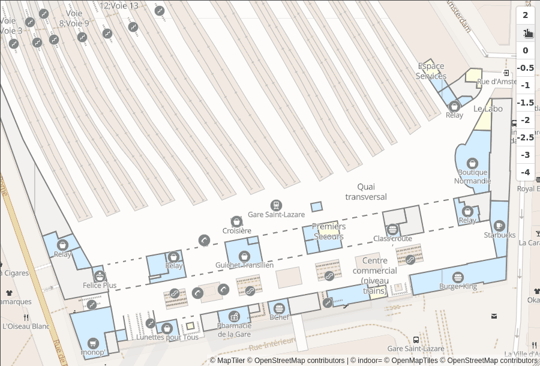

# mapbox-gl-indoorequal  [](https://www.npmjs.com/package/mapbox-gl-indoorequal)

mapbox-gl-indoorequal is a [maplibre-gl][] or [mapbox-gl.js][mapbox-gl] plugin to display indoor data from [indoor=][].

It provides:

*   load vector tiles from indoorequal.org tile server or your own
*   display GeoJSON data
*   a default style of the indoor tiles
*   a way to customize the style and load your sprites
*   a level control to change the level displayed on the map
*   a programatic API to list the levels available and set the level displayed

[**See the demo**](https://indoorequal.github.io/mapbox-gl-indoorequal).



Discover:

*   the frontend: <https://github.com/indoorequal/indoorequal.org>
*   the backend: <https://github.com/indoorequal/indoorequal>

## Install

Recommended versions:

*   **mapbox-gl** to use is the **1.12** (released in august 2020) or higher
*   **maplibre-gl** **1.15.2**

**With NPM**

    npm install --save mapbox-gl-indoorequal

**In the browser**

```html
<script src="https://unpkg.com/mapbox-gl-indoorequal@latest/dist/mapbox-gl-indoorequal.umd.min.js"></script>
<link href="https://unpkg.com/mapbox-gl-indoorequal@latest/mapbox-gl-indoorequal.css" rel="stylesheet" />
```

## Example

Get your free key at [indoorequal.com](https://indoorequal.com).

```javascript
import mapboxgl from 'mapbox-gl';
import IndoorEqual from 'mapbox-gl-indoorequal';
import 'mapbox-gl-indoorequal/mapbox-gl-indoorequal.css';

mapboxgl.accessToken = '<your-token>';

const map = new mapboxgl.Map({
  container: 'map',
  style: 'mapbox://styles/mapbox/light-v10',
  center: [2.3601072, 48.876853],
  zoom: 18
});

const indoorEqual = new IndoorEqual(map, { apiKey: 'mykey' });
map.addControl(indoorEqual);
```

## Loading the default sprite

The default style make uses of a sprite that has to be loaded manually
as [mapbox-gl][] require an absolute path. The sprite is already builded
and available in the `sprite` directory.

To load the sprite, use the `loadSprite` method with the absolute path
to the sprite and its name `/directory-to-change/indoorequal`.

**Usage with [Parcel](https://parceljs.org/)**

Install the
[parcel-plugin-static-files-copy](https://github.com/elwin013/parcel-plugin-static-files-copy)
package and add to your `package.json`:

    "staticFiles": {
      "staticPath": "node_modules/mapbox-gl-indoorequal/sprite"
    },

Then load the sprite:

```javascript
const indoorequal = new IndoorEqual(map, { apiKey: 'myKey' });
indoorequal.loadSprite('/indoorequal');
```

**Usage with [webpack](https://webpack.js.org/)**

Install the
[copy-webpack-plugin](https://github.com/webpack-contrib/copy-webpack-plugin)
package and add to your webpack config:

```javascript
const CopyPlugin = require('copy-webpack-plugin');

module.exports = {
  plugins: [
    new CopyPlugin({
      patterns: [
        { from: 'node_modules/mapbox-gl-indoorequal/sprite' },
      ],
    }),
  ],
};
```

Then load the sprite:

```javascript
const indoorequal = new IndoorEqual(map, { apiKey: 'myKey' });
indoorequal.loadSprite('/indoorequal');
```

## API

<!-- Generated by documentation.js. Update this documentation by updating the source code. -->

#### Table of Contents

*   [IndoorEqual](#indoorequal)
    *   [Parameters](#parameters)
    *   [Properties](#properties)
    *   [remove](#remove)
    *   [on](#on)
        *   [Parameters](#parameters-1)
    *   [off](#off)
        *   [Parameters](#parameters-2)
    *   [onAdd](#onadd)
    *   [onRemove](#onremove)
    *   [setLevel](#setlevel)
        *   [Parameters](#parameters-3)
    *   [updateLevel](#updatelevel)
        *   [Parameters](#parameters-4)
    *   [loadSprite](#loadsprite)
        *   [Parameters](#parameters-5)
    *   [setHeatmapVisible](#setheatmapvisible)
        *   [Parameters](#parameters-6)
*   [IndoorEqual#levelschange](#indoorequallevelschange)
*   [IndoorEqual#levelchange](#indoorequallevelchange)

### IndoorEqual

Load the indoor= source and layers in your map.

#### Parameters

*   `map` **[object](https://developer.mozilla.org/docs/Web/JavaScript/Reference/Global_Objects/Object)** the mapbox-gl/maplibre-gl instance of the map
*   `options` **[object](https://developer.mozilla.org/docs/Web/JavaScript/Reference/Global_Objects/Object)**  (optional, default `{}`)

    *   `options.url` **[string](https://developer.mozilla.org/docs/Web/JavaScript/Reference/Global_Objects/String)?** Override the default tiles URL (<https://tiles.indoorequal.org/>).
    *   `options.geojson` **[object](https://developer.mozilla.org/docs/Web/JavaScript/Reference/Global_Objects/Object)?** GeoJSON data with with key as layer name and value with geojson features
    *   `options.apiKey` **[string](https://developer.mozilla.org/docs/Web/JavaScript/Reference/Global_Objects/String)?** The API key if you use the default tile URL (get your free key at [indoorequal.com](https://indoorequal.com)).
    *   `options.layers` **[array](https://developer.mozilla.org/docs/Web/JavaScript/Reference/Global_Objects/Array)?** The layers to be used to style indoor= tiles. Take a look a the [layers.js file](https://github.com/indoorequal/mapbox-gl-indoorequal/blob/master/src/layers.js) file and the [vector schema](https://indoorequal.com/schema)
    *   `options.heatmap` **[boolean](https://developer.mozilla.org/docs/Web/JavaScript/Reference/Global_Objects/Boolean)?** Should the heatmap layer be visible at start (true : visible, false : hidden). Defaults to true/visible.

#### Properties

*   `level` **[string](https://developer.mozilla.org/docs/Web/JavaScript/Reference/Global_Objects/String)** The current level displayed
*   `levels` **[array](https://developer.mozilla.org/docs/Web/JavaScript/Reference/Global_Objects/Array)** The levels that can be displayed in the current view

Returns **[IndoorEqual](#indoorequal)** `this`

#### remove

Remove any layers, source and listeners and controls

#### on

Add an event listener

##### Parameters

*   `name` **[string](https://developer.mozilla.org/docs/Web/JavaScript/Reference/Global_Objects/String)** the name of the event
*   `fn` **[function](https://developer.mozilla.org/docs/Web/JavaScript/Reference/Statements/function)** the function to be called when the event is emitted

#### off

Remove an event listener.

##### Parameters

*   `name` **[string](https://developer.mozilla.org/docs/Web/JavaScript/Reference/Global_Objects/String)** the name of the event
*   `fn` **[function](https://developer.mozilla.org/docs/Web/JavaScript/Reference/Statements/function)** the same function when on() was called

#### onAdd

Add the level control to the map
Used when adding the control via the map instance: map.addControl(indoorEqual)

#### onRemove

Remove the level control
Used when removing the control via the map instance: map.removeControl(indoorEqual)

#### setLevel

Set the displayed level.

##### Parameters

*   `level` **[string](https://developer.mozilla.org/docs/Web/JavaScript/Reference/Global_Objects/String)** the level to be displayed

#### updateLevel

Set the displayed level.

##### Parameters

*   `level` **[string](https://developer.mozilla.org/docs/Web/JavaScript/Reference/Global_Objects/String)** the level to be displayed

**Meta**

*   **deprecated**: Use setLevel instead

#### loadSprite

Load a sprite and add all images to the map

##### Parameters

*   `baseUrl` **[string](https://developer.mozilla.org/docs/Web/JavaScript/Reference/Global_Objects/String)** the baseUrl where to load the sprite
*   `options` **[object](https://developer.mozilla.org/docs/Web/JavaScript/Reference/Global_Objects/Object)**  (optional, default `{}`)

    *   `options.update` **[boolean](https://developer.mozilla.org/docs/Web/JavaScript/Reference/Global_Objects/Boolean)?** Update existing image (default false)

Returns **[Promise](https://developer.mozilla.org/docs/Web/JavaScript/Reference/Global_Objects/Promise)** It resolves an hash of images.

#### setHeatmapVisible

Change the heatmap layer visibility

##### Parameters

*   `visible` **[boolean](https://developer.mozilla.org/docs/Web/JavaScript/Reference/Global_Objects/Boolean)** True to make it visible, false to hide it

### IndoorEqual#levelschange

Emitted when the list of available levels has been updated

Type: [array](https://developer.mozilla.org/docs/Web/JavaScript/Reference/Global_Objects/Array)

### IndoorEqual#levelchange

Emitted when the current level has been updated

Type: [string](https://developer.mozilla.org/docs/Web/JavaScript/Reference/Global_Objects/String)

## Develop

**Build the plugin and watch for changes**

    yarn dev

**Run tests**

    yarn test [--watch]

**Build a new version**

    yarn build

**Generate the documentation**

    yarn doc

**Generate the sprite**

    yarn sprite

## License

BSD

[indoor=]: https://indoorequal.org/

[maplibre-gl]: https://github.com/maplibre/maplibre-gl-js

[mapbox-gl]: https://github.com/mapbox/mapbox-gl-js
